# Automobile Sales Analysis During Recession Periods

This project explores historical automobile sales data to identify trends and patterns during recession and non-recession periods. The analysis includes visualizations using line plots, bar charts, pie charts, scatter plots, and maps.

## Dataset Description

The dataset includes the following variables:
- **Date**: Observation date.
- **Recession**: Binary indicator (1: recession, 0: normal period).
- **Automobile_Sales**: Number of vehicles sold.
- **GDP**: Per capita GDP value (USD).
- **Unemployment_Rate**: Monthly unemployment rate.
- **Consumer_Confidence**: Synthetic consumer confidence index.
- **Seasonality_Weight**: Seasonality effect on sales.
- **Price**: Average vehicle price.
- **Advertising_Expenditure**: Company's advertising cost.
- **Vehicle_Type**: Type of vehicles sold.
- **Competition**: Market competition metric.
- **Month**/**Year**: Extracted from the Date column.

## Visualizations Included

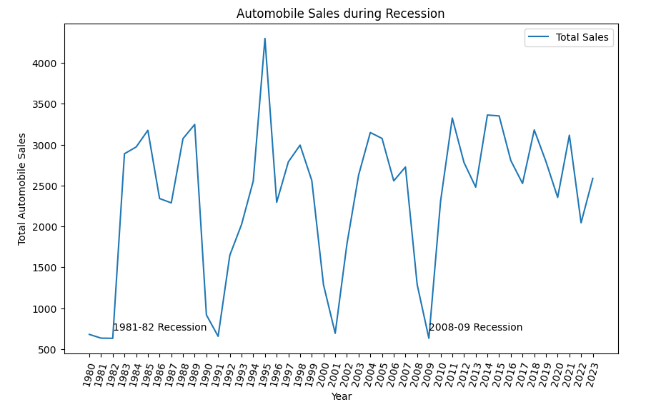
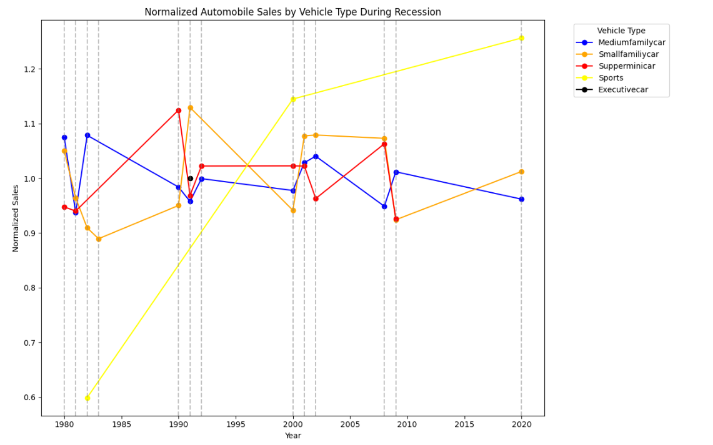
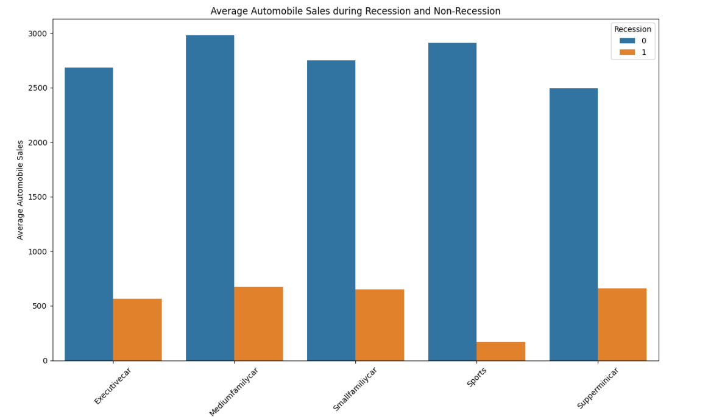
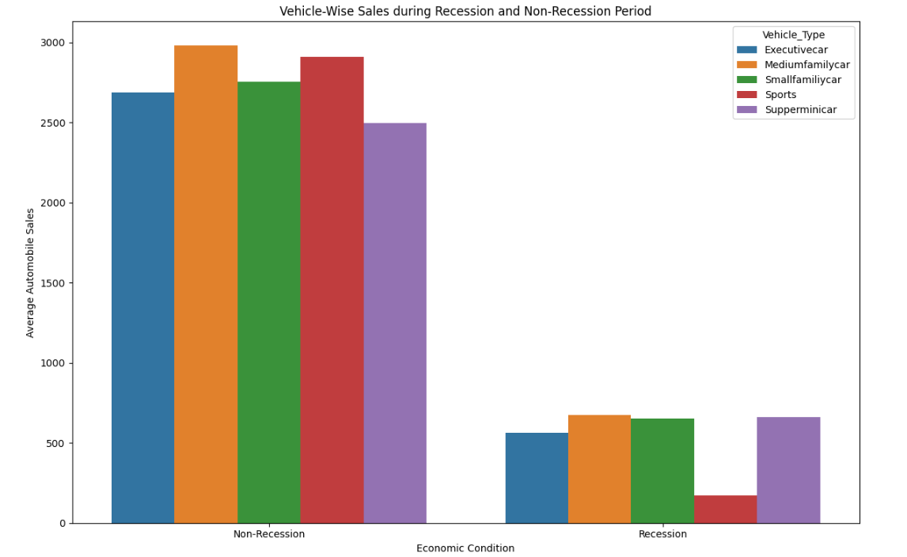
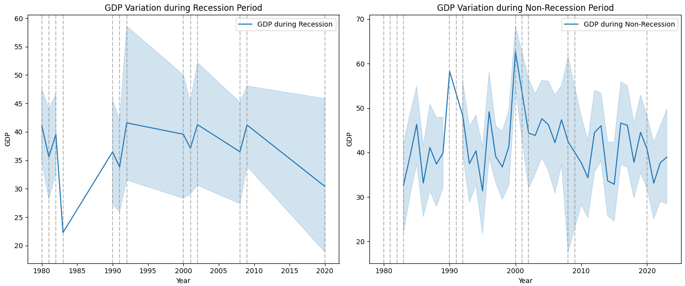

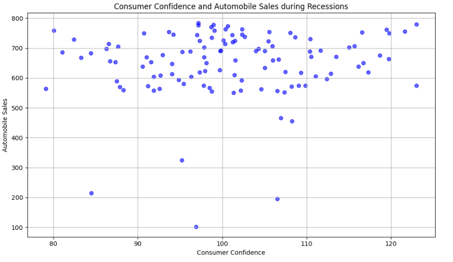
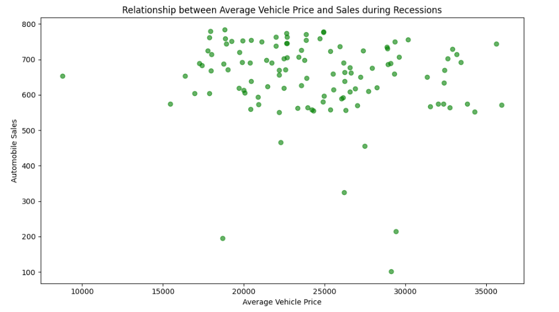
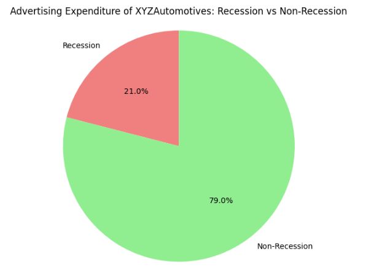
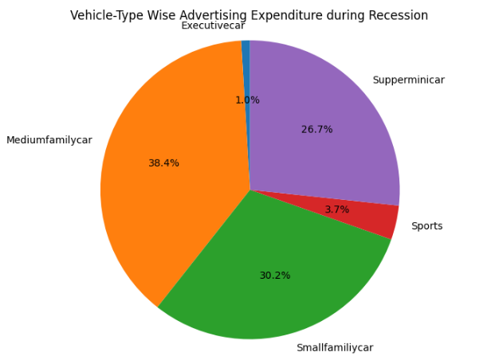
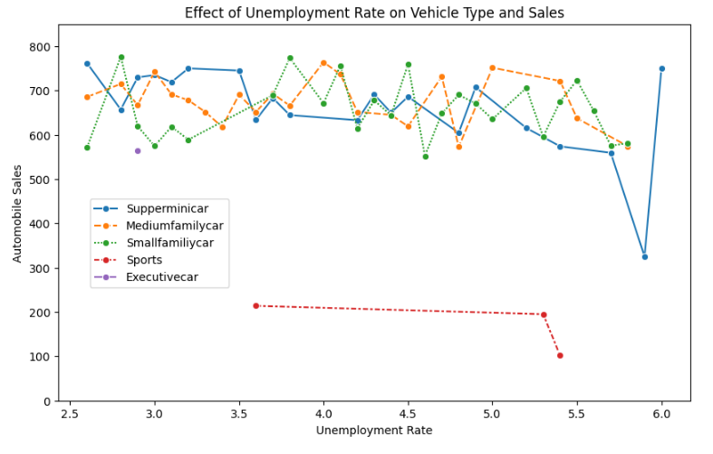
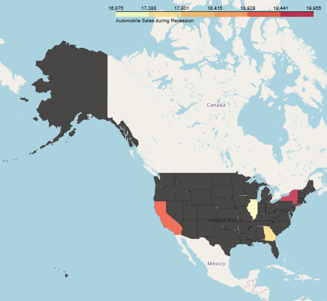

## Getting Started

1. Clone the repository or download the notebook.
2. Install required packages:
   ```bash
   pip install pandas matplotlib seaborn folium
   ```
3. Run the `Scenario_polished.ipynb` notebook.

## Sample Visualizations


> Replace the placeholder image paths with actual screenshots from your notebook output.

## License

This project is part of the IBM Data Visualization course and is for educational purposes.
