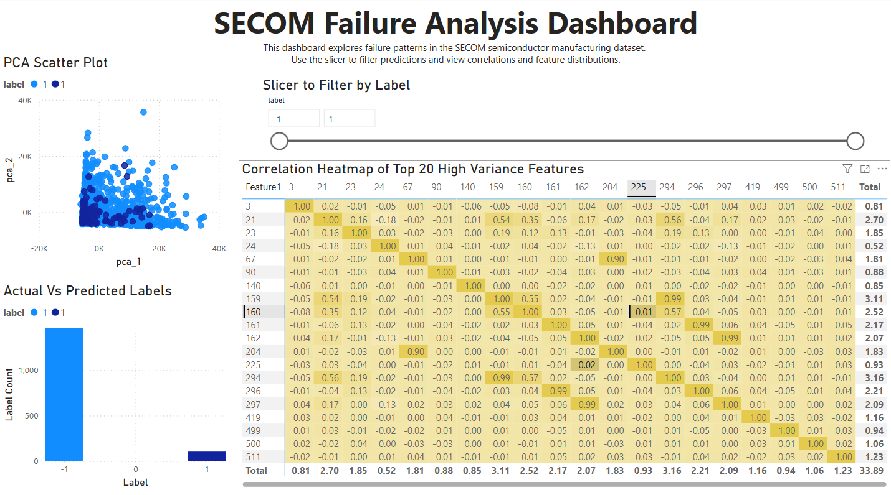

# 🔬 SECOM Semiconductor Failure Analysis with Python & Power BI

This project analyzes sensor data from a semiconductor manufacturing process to identify patterns in failure cases. We used Python for data cleaning, modeling, and visualization. Then, we exported the processed dataset and created an interactive dashboard in Power BI.

---

## 🎯 Objective

To explore and model the SECOM dataset in order to:
- Identify factors contributing to production failures
- Visualize relationships between features and failure rates
- Deliver insights via an interactive Power BI dashboard

---

## 🛠️ Tools & Technologies

- **Python**: pandas, numpy, scikit-learn, seaborn, matplotlib
- **Power BI**: Bar charts, scatter plots, slicers, heatmaps
- **Jupyter Notebook**: Main analysis in `secom_failure_analysis.ipynb`

---

## 📁 File Structure

| File / Folder                | Description                                          |
|-----------------------------|------------------------------------------------------|
| `secom_failure_analysis.ipynb` | Main Jupyter notebook containing data prep, modeling, and visualization |
| `Images/Label Distribution.png` | Bar chart of label (failure) distribution           |
| `Images/Correlation Heatmap.png` | Correlation heatmap of top 20 high-variance features |
| `Images/PCA Scatter plot.png` | 2D PCA plot showing class separation               |
| `Images/Top 20 Features.png` | Top 20 feature importances from Random Forest       |
| `Images/Dashboard.png`       | Screenshot of final Power BI dashboard              |
| `secom_model_output.csv`     | Exported predictions used in Power BI               |
| `correlation_heatmap.csv`    | Flattened heatmap data used in Power BI             |
| `secom_failure_analysis.pbix`| Power BI report file                                |

---

## 🔍 Workflow Overview

### 🧹 1. Data Cleaning & Preprocessing
- Merged feature and label files
- Imputed missing values using mean
- Removed low-variance features

### 📊 2. Exploratory Data Analysis
- Visualized label distribution
- Identified high-variance features
- Created correlation heatmap for top 20 features

### 🔠 3. Feature Selection & Modeling
- Trained and evaluated several classifiers (Random Forest, Logistic Regression, SVM)
- Used Random Forest to extract feature importances
- Applied PCA for dimensionality reduction

### 📈 4. Visualization (Python & Power BI)
- Exported model results to CSV
- Created interactive dashboard in Power BI including:
  - PCA scatter plot
  - Heatmap of feature correlations
  - Top feature bar chart
  - Label distribution chart
  - Slicers for filtering by prediction and label

---

## 🖼️ Visual Highlights

### 🔢 Label Distribution

---

### 🔥 Correlation Heatmap (Top 20 High Variance Features)

---

### 🌐 PCA Scatter Plot

---

### 🧠 Top 20 Features from Random Forest

---

### 📊 Power BI Dashboard

This dashboard was created using the outputs from the Jupyter Notebook.

---

## 📌 Key Takeaways

- Strong correlation between a few key sensors and failure labels
- PCA showed some visible separation between failure and non-failure cases
- Random Forest revealed the most influential features for prediction
- Power BI enabled intuitive visual analysis and business-friendly reporting

---

## 📜 Credits & Dataset

- Dataset: SECOM Manufacturing Data from [UCI ML Repository](https://archive.ics.uci.edu/ml/datasets/SECOM)
👤Created by:
Thant Sin Win

📧 xeyzo.leo@gmail.com

🌐 https://www.linkedin.com/in/thant-sin-win/

---
