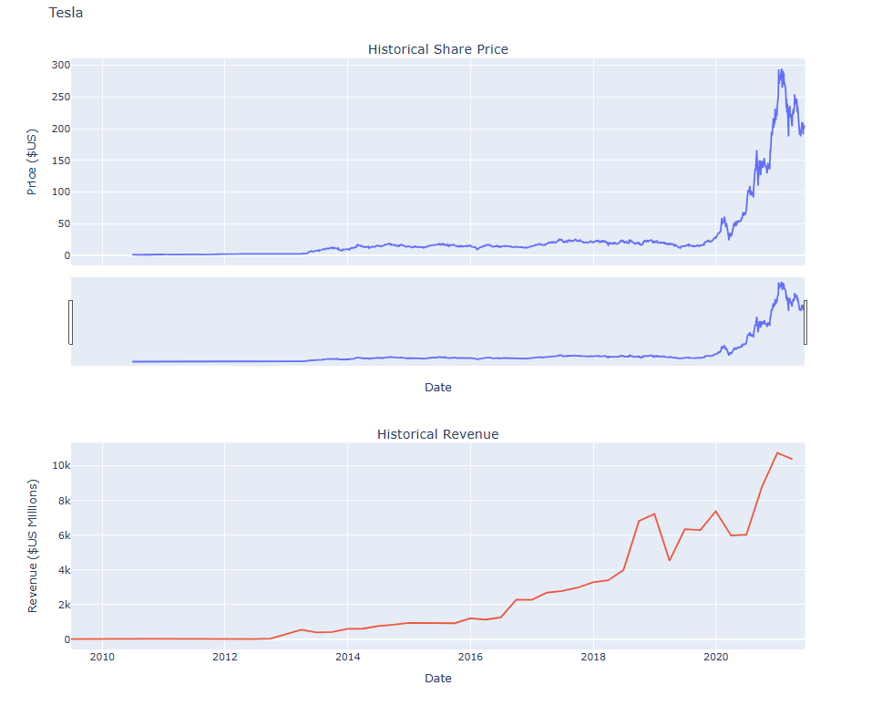

# 📊 Tesla Stock and Revenue Data Visualization Project

This project visualizes Tesla's historical **stock prices** and **revenue data** using data extracted from two sources:  
- **Yahoo Finance API (`yfinance`)** for stock prices  
- **Web scraping** from a public HTML table for revenue data

The visualization is created using **Plotly**, an interactive graphing library that allows rich, dynamic charts directly in Jupyter Notebook.

---

## 🧠 Objective

The main goal of this project is to:
- Extract and clean Tesla stock price and revenue data from different sources
- Visualize both data streams in a dual-axis interactive graph
- Demonstrate skills in Python, data extraction, web scraping, data cleaning, and visualization

---

## 📦 Technologies Used

| Tool/Library        | Purpose                                       |
|---------------------|-----------------------------------------------|
| Python              | Main programming language                     |
| [yfinance](https://pypi.org/project/yfinance/)        | Stock price extraction via Yahoo Finance API |
| [BeautifulSoup (bs4)](https://www.crummy.com/software/BeautifulSoup/) | HTML parsing and web scraping            |
| [Pandas](https://pandas.pydata.org/)             | Data manipulation and cleaning             |
| [Plotly](https://plotly.com/python/)             | Interactive visualization                   |
| [Jupyter Notebook](https://jupyter.org/)        | Interactive coding and presentation         |

---

## 📈 Final Output




---

## 🛠️ How It Works

### Step 1: Install Required Libraries
```bash
pip install yfinance
pip install bs4
pip install nbformat
pip install --upgrade plotly

Step 2: Import Libraries and Set Plotly Renderer

import yfinance as yf
import pandas as pd
import requests
from bs4 import BeautifulSoup
import plotly.graph_objects as go
from plotly.subplots import make_subplots
import plotly.io as pio
pio.renderers.default = "iframe"

Step 3: Extract Tesla Stock Data (yfinance)

tesla = yf.Ticker("TSLA")
tesla_data = tesla.history(period="max")
tesla_data.reset_index(inplace=True)

Step 4: Extract Tesla Revenue Data (Web Scraping)

url = "https://cf-courses-data.s3.us.cloud-object-storage.appdomain.cloud/IBMDeveloperSkillsNetwork-PY0220EN-SkillsNetwork/labs/project/revenue.htm"
html_data = requests.get(url).text
soup = BeautifulSoup(html_data, "html.parser")
# Scrape and clean revenue data...

Step 5: Visualize with Plotly

make_graph(tesla_data, tesla_revenue, "Tesla")

📊 Key Features
Combines API data and web scraped data

Interactive dual-subplot visualization:

Tesla’s stock price over time

Tesla’s quarterly revenue over time

Cleaned and transformed financial data ready for analysis

📁 Project Structure

Tesla-Stock-Visualization/
├── README.md
├── Tesla Stock and Revenue Data Visualization Project.ipynb
├── tesla_graph.png

🚀 Future Improvements

Add user input for choosing any stock (not just Tesla)

Deploy the notebook on AWS SageMaker

Include financial ratios or other KPIs (e.g. profit margin, PE ratio)

Export the graphs as HTML reports

👤 Author
Thant Sin Win

📧 xeyzo.leo@gmail.com

🌐 https://www.linkedin.com/in/thant-sin-win/

📄 License

This project is part of the IBM Data Visualization course and is for educational purposes.


---


